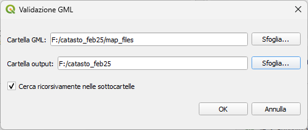

# QGIS GML Validation Tool

Strumento di validazione per file GML (Geography Markup Language) del catasto, progettato per funzionare in QGIS. 

L'obiettivo di questo repository è quello di raccogliere le problematiche riscontrate nei file e segnalarlo all'AdE.

## Risultati Analisi

[Vai](./output/README.md)

## Tabella Errori di Validazione per Regione

| Regione               | Auto intersezione | Auto intersezione con anello | Troppi pochi punti nella geometria | Altri errori |   Totale |
| --------------------- | ----------------: | ---------------------------: | ---------------------------------: | -----------: | -------: |
| Sicilia               |                94 |                           52 |                                 32 |            0 |      178 |
| Puglia                |                74 |                           27 |                                 11 |            0 |      112 |
| Campania              |                87 |                           16 |                                  5 |            0 |      108 |
| Toscana               |                65 |                           22 |                                 17 |            0 |      104 |
| Piemonte              |                65 |                           21 |                                 17 |            0 |      103 |
| Lazio                 |                83 |                           12 |                                  3 |            0 |       98 |
| Emilia-Romagna        |                47 |                           31 |                                 16 |            0 |       94 |
| Calabria              |                80 |                            6 |                                  5 |            1 |       92 |
| Lombardia             |                55 |                           20 |                                  3 |            0 |       78 |
| Abruzzo               |                40 |                           18 |                                 10 |            0 |       68 |
| Veneto                |                28 |                           14 |                                 15 |            0 |       57 |
| Sardegna              |                35 |                           13 |                                  8 |            0 |       56 |
| Marche                |                30 |                           20 |                                  5 |            0 |       55 |
| Basilicata            |                46 |                            3 |                                  3 |            0 |       52 |
| Friuli-Venezia Giulia |                12 |                            7 |                                  3 |            0 |       22 |
| Liguria               |                17 |                            3 |                                  2 |            0 |       22 |
| Umbria                |                12 |                            3 |                                  5 |            0 |       20 |
| Molise                |                 7 |                            0 |                                  2 |            0 |        9 |
| Valle d'Aosta         |                 9 |                            0 |                                  0 |            0 |        9 |
| **Totale**            |           **886** |                      **288** |                            **162** |        **1** | **1337** |

## Descrizione

Questo strumento consente di validare geometricamente i file GML del catasto, verificando la conformità con gli standard OGC (Open Geospatial Consortium). Esegue una scansione approfondita di tutti i file GML presenti in una cartella selezionata e produce report dettagliati sui problemi riscontrati.

## Funzionalità principali

- Scansione automatica di tutti i file GML in una cartella selezionata dall'utente
- Validazione delle geometrie utilizzando la libreria GEOS tramite QGIS
- Generazione di un riepilogo completo dei risultati della validazione
- Esportazione dei risultati in formato CSV (file di riepilogo e file di dettaglio)
- Interfaccia utente semplice e intuitiva integrata in QGIS

## Librerie e tecnologie utilizzate

- **QGIS**: ambiente di base che fornisce le funzionalità GIS
- **GEOS (Geometry Engine Open Source)**: utilizzato attraverso QGIS per la validazione geometrica
- **GML (Geography Markup Language)**: formato standard OGC basato su XML per la rappresentazione di informazioni geografiche
- **Librerie Python**:
  - `os`: per operazioni sul filesystem
  - `qgis.core`: per accedere alle funzionalità di QGIS (QgsVectorLayer, QgsGeometry)
  - `qgis.PyQt.QtWidgets`: per interfaccia utente (QFileDialog, QMessageBox)
  - `qgis.utils`: per interagire con l'interfaccia di QGIS (iface)
  - `csv`: per l'esportazione dei risultati in formato CSV

## Verifiche effettuate

Lo strumento esegue un'analisi completa della validità geometrica di ogni feature contenuta nei file GML:

1. **Verifica di caricamento**: 
   - Controlla se il formato GML è valido e può essere interpretato da QGIS
   - Verifica la presenza di elementi XML conformi allo schema GML
   - Controlla l'accessibilità e la leggibilità del file

2. **Validazione geometrica GEOS**: 
   - Verifica ogni geometria presente nel file utilizzando la libreria GEOS
   - Applica le regole di validazione degli standard OGC
   - Analizza la struttura topologica di ogni singola geometria
   - Identifica anomalie nelle relazioni tra elementi geometrici

3. **Analisi statistica**: 
   - Conteggia il numero totale di feature presenti in ogni file
   - Calcola la percentuale di geometrie valide/invalide
   - Determina la gravità complessiva dei problemi riscontrati

## Messaggi di errore

Lo strumento è in grado di rilevare numerosi tipi di errori geometrici, tra cui:

- **Loading Error** (Errore di caricamento): quando il file GML non può essere caricato correttamente in QGIS

- **Geometry Errors** (Errori geometrici):
  - **Self-intersection** (Auto-intersezione): quando una linea o un bordo di poligono si interseca con se stesso
  - **Ring self-intersection** (Auto-intersezione di anelli): quando un anello interno di un poligono si interseca con se stesso
  - **Hole outside shell** (Buco esterno al guscio): quando un anello interno (buco) si trova all'esterno del poligono principale
  - **Nested holes** (Buchi annidati): quando un anello interno è contenuto in un altro anello interno
  - **Duplicated rings** (Anelli duplicati): quando più anelli interni hanno la stessa geometria
  - **Invalid coordinate** (Coordinate non valide): quando sono presenti coordinate non numeriche o fuori intervallo
  - **Ring not closed** (Anello non chiuso): quando un anello non ha lo stesso punto di inizio e fine
  - **Too few points** (Troppo pochi punti): quando una linea o un poligono ha meno punti di quelli necessari
  - **Invalid geometry type** (Tipo di geometria non valido): quando la geometria non corrisponde al tipo dichiarato
  - **Polygon with non-conforming orientation** (Poligono con orientamento non conforme): quando i poligoni non seguono la regola dell'orientamento OGC

## File di output

Lo strumento produce due file CSV:

1. **File di riepilogo** (`nome_cartella_validazione.csv`):
   - Nome del file GML
   - Stato della validazione
   - Numero totale di feature
   - Numero di feature invalide

2. **File di dettaglio** (`nome_cartella_validazione_dettagli.csv`):
   - Nome del file GML
   - ID della feature problematica
   - Messaggio di errore specifico
   - Tipo di errore riscontrato

## Come utilizzare

1. Caricare lo script nell'editor Python di QGIS
2. Eseguire lo script
3. Selezionare la cartella contenente i file GML da validare
4. Attendere il completamento della validazione
5. Visualizzare i risultati nella console Python di QGIS
6. Scegliere se salvare i risultati in formato CSV

## Requisiti

- QGIS 3.x o superiore
- Accesso in lettura alla cartella contenente i file GML
- Accesso in scrittura alla cartella di destinazione per i file CSV di output

## Utility

- [VisiData](https://www.visidata.org/)
- [QGIS](https://www.qgis.org/)
