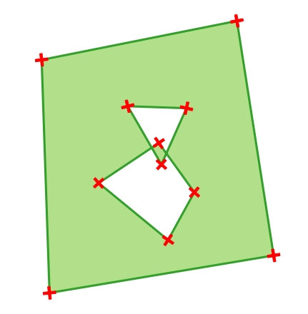
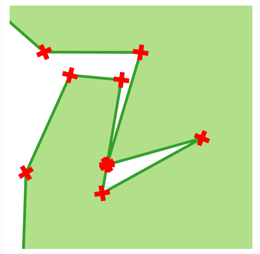
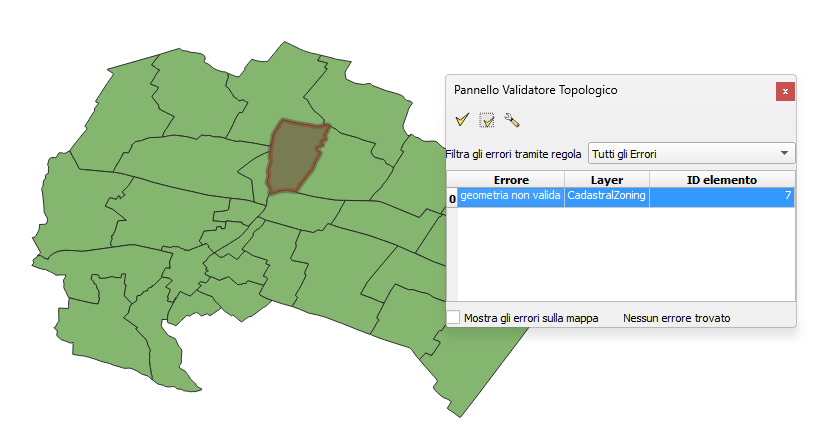

# Report Analisi

# Distribuzione file (ple e map) per regione

| Regione               | Count Ple | Count Map |
| --------------------- | --------: | --------: |
| Lombardia             |      1500 |      1498 |
| Piemonte              |      1180 |      1180 |
| Veneto                |       560 |       660 |
| Campania              |       547 |       547 |
| Calabria              |       404 |       483 |
| Sicilia               |       391 |       391 |
| Lazio                 |       378 |       378 |
| Sardegna              |       376 |       376 |
| Emilia-Romagna        |       330 |       330 |
| Abruzzo               |       305 |       305 |
| Toscana               |       273 |       273 |
| Puglia                |       256 |       256 |
| Liguria               |       234 |       234 |
| Marche                |       225 |       225 |
| Friuli-Venezia Giulia |       215 |       215 |
| Molise                |       136 |       136 |
| Basilicata            |       131 |       131 |
| Umbria                |        92 |        92 |
| Valle d'Aosta         |        74 |        74 |

# Messaggio di errore per Ple e Map e numero di casi

| Messaggio di errore                            | Count Ple | Percent Ple | Count Map | Percent Map |
| ---------------------------------------------- | --------: | ----------: | --------: | ----------: |
| Auto intersezione                              |       886 |       66.27 |        23 |       65.71 |
| Auto intersezione con anello                   |       288 |       21.54 |         6 |       17.14 |
| Troppi pochi punti nella geometria             |       162 |       12.12 |         5 |       14.29 |
| Errore nella lettura del file: not well-formed |         1 |        0.07 |         - |           - |
| Il buco si trova all'esterno del confine       |         - |           - |         1 |        2.86 |

# Invalidità file (Ple e Map) per Regione

| Regione               | Count Ple | Percent Ple | Count Map | Percent Map |
| --------------------- | --------: | ----------: | --------: | ----------: |
| Sicilia               |       178 |       13.31 |         9 |       25.71 |
| Puglia                |       112 |        8.38 |         - |           - |
| Campania              |       108 |        8.08 |         - |           - |
| Toscana               |       104 |        7.78 |         2 |        5.71 |
| Piemonte              |       103 |        7.70 |         4 |       11.43 |
| Lazio                 |        98 |        7.33 |         1 |        2.86 |
| Emilia-Romagna        |        94 |        7.03 |         1 |        2.86 |
| Calabria              |        92 |        6.88 |         2 |        5.71 |
| Lombardia             |        78 |        5.83 |         1 |        2.86 |
| Abruzzo               |        68 |        5.09 |         1 |        2.86 |
| Veneto                |        57 |        4.26 |         6 |       17.14 |
| Sardegna              |        56 |        4.19 |         4 |       11.43 |
| Marche                |        55 |        4.11 |         1 |        2.86 |
| Basilicata            |        52 |        3.89 |         - |           - |
| Friuli-Venezia Giulia |        22 |        1.65 |         - |           - |
| Liguria               |        22 |        1.65 |         - |           - |
| Umbria                |        20 |        1.50 |         3 |        8.57 |
| Molise                |         9 |        0.67 |         - |           - |
| Valle d'Aosta         |         9 |        0.67 |         - |           - |

# Stato dei file per Ple e Map

| Stato                       | Count Ple | Percent Ple | Count Map | Percent Map |
| --------------------------- | --------- | ----------- | --------- | ----------- |
| Valido                      | 6681      | 87.83       | 7569      | 99.54       |
| Contiene geometrie invalide | 925       | 12.16       | 35        | 0.46        |
| XML malformato              | 1         | 0.01        | -         | -           |

# Feature Invalide per Ple e Map

| Feature invalidate | Count Ple | Percent Ple | Count Map | Percent Map |
| ------------------ | --------: | ----------: | --------: | ----------: |
| 0                  |      6681 |       87.83 |      7569 |       99.54 |
| 1                  |       668 |        8.78 |        35 |        0.46 |
| 2                  |       164 |        2.16 |         - |           - |
| 3                  |        58 |        0.76 |         - |           - |
| 4                  |        19 |        0.25 |         - |           - |
| 5                  |        11 |        0.14 |         - |           - |
| 6                  |         3 |        0.04 |         - |           - |
| 7                  |         1 |        0.01 |         - |           - |
| 10                 |         1 |        0.01 |         - |           - |
| N/A                |         1 |        0.01 |         - |           - |

##  Invalidità Particelle

## Auto intersezione - Self-intersection

| Regione               | count | percent% |
| --------------------- | ----: | -------: |
| Sicilia               |    94 |    10.61 |
| Campania              |    87 |     9.82 |
| Lazio                 |    83 |     9.37 |
| Calabria              |    80 |     9.03 |
| Puglia                |    74 |     8.35 |
| Piemonte              |    65 |     7.34 |
| Toscana               |    65 |     7.34 |
| Lombardia             |    55 |     6.21 |
| Emilia-Romagna        |    47 |     5.30 |
| Basilicata            |    46 |     5.19 |
| Abruzzo               |    40 |     4.51 |
| Sardegna              |    35 |     3.95 |
| Marche                |    30 |     3.39 |
| Veneto                |    28 |     3.16 |
| Liguria               |    17 |     1.92 |
| Friuli-Venezia Giulia |    12 |     1.35 |
| Umbria                |    12 |     1.35 |
| Valle d'Aosta         |     9 |     1.02 |
| Molise                |     7 |     0.79 |

Questo errore si verifica quando una geometria tocca se stessa.

## Auto intersezione con anelli - Ring self-intersection

| Regione               | count | percent% |
| --------------------- | ----: | -------: |
| Sicilia               |    52 |    18.06 |
| Emilia-Romagna        |    31 |    10.76 |
| Puglia                |    27 |     9.38 |
| Toscana               |    22 |     7.64 |
| Piemonte              |    21 |     7.29 |
| Lombardia             |    20 |     6.94 |
| Marche                |    20 |     6.94 |
| Abruzzo               |    18 |     6.25 |
| Campania              |    16 |     5.56 |
| Veneto                |    14 |     4.86 |
| Sardegna              |    13 |     4.51 |
| Lazio                 |    12 |     4.17 |
| Friuli-Venezia Giulia |     7 |     2.43 |
| Calabria              |     6 |     2.08 |
| Basilicata            |     3 |     1.04 |
| Liguria               |     3 |     1.04 |
| Umbria                |     3 |     1.04 |

Questo errore si verifica quando una geometria tocca se stessa e genera un anello.

## Troppi pochi punti nella geometria - Too few points

| Regione               | count | percent% |
| --------------------- | ----: | -------: |
| Sicilia               |    32 |    19.75 |
| Piemonte              |    17 |    10.49 |
| Toscana               |    17 |    10.49 |
| Emilia-Romagna        |    16 |     9.88 |
| Veneto                |    15 |     9.26 |
| Puglia                |    11 |     6.79 |
| Abruzzo               |    10 |     6.17 |
| Sardegna              |     8 |     4.94 |
| Calabria              |     5 |     3.09 |
| Campania              |     5 |     3.09 |
| Marche                |     5 |     3.09 |
| Umbria                |     5 |     3.09 |
| Basilicata            |     3 |     1.85 |
| Friuli-Venezia Giulia |     3 |     1.85 |
| Lazio                 |     3 |     1.85 |
| Lombardia             |     3 |     1.85 |
| Liguria               |     2 |     1.23 |
| Molise                |     2 |     1.23 |

## Errore nella lettura del file: not well-formed

| Regione  | File                      | Feature ID | Messaggio di errore                                                                |
| -------- | ------------------------- | ---------- | ---------------------------------------------------------------------------------- |
| Calabria | B968_CASTELSILANO_ple.gml | N/A        | Errore nella lettura del file: not well-formed (invalid token): line 16, column 74 |

##  Invalidità Mappe

| Regione | File                     | Feature ID | Messaggio di errore                                                |
| ------- | ------------------------ | ---------- | ------------------------------------------------------------------ |
| Veneto  | A001_ABANO TERME_map.gml | 7          | Il buco si trova all'esterno del confine (Hole lies outside shell) |

[gis.stackexchange](https://gis.stackexchange.com/questions/254413/how-to-fix-hole-lies-outside-shell)

[Doc QGIS](https://download.qgis.org/qgisdata/QGIS-Documentation-3.16/live/html/it/docs/user_manual/processing_algs/qgis/vectorgeometry.html#types-of-error-messages-and-their-meanings)
